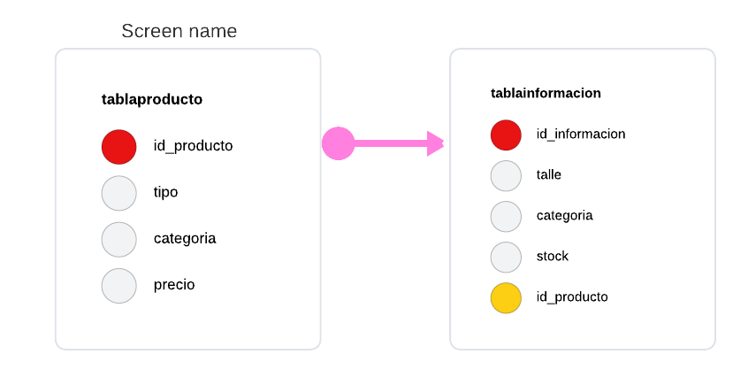

# Trabajo Práctico: Tienda de Ropa

### Participantes:
- *Alumno 1: Ariadna, Avila*
- *Alumno 2: Juan Marcos, Lorenzo*

## Descripción del Trabajo
Este trabajo práctico consiste en el diseño y desarrollo para una web de tienda de ropa, la cual el usuario proda interactuar en este caso con las distintas prensas disponibles, su stock y su talle para poder agregarla a su carrito. La base de datos está diseñada para gestionar los productos y su información asociada, permitiendo a la tienda administrar de manera eficiente su catálogo de productos.

## Estructura de la Base de Datos

La base de datos está compuesta por dos tablas principales:

1. *tablaProducto*:
   - Esta tabla almacena la información principal de cada producto disponible en la tienda, como su nombre, código, precio y cantidad en stock.
   - Campos principales:
     - id_producto (clave primaria)
     - tipo
     - categoria
     - precio

2. *tablaInformacion*:
   - Esta tabla contiene información adicional o detallada sobre los productos, como la descripción del producto, la categoría y otros detalles relevantes.
   - Campos principales:
     - id_informacion (clave primaria)
     - id_producto (clave foránea que referencia a la tabla tablaProducto)
     - talle
     - categoria
     - stock
     

### Relación entre las Tablas:S
- La relación entre *tabla_producto* y *tabla_informacion* es de *uno a uno, donde cada producto en la **tablaproducto* tiene una entrada correspondiente en la *tablainformacion* que contiene información más detallada.
- La clave foránea id_producto en la *tablainformacion* establece esta relación y asegura la coherencia de los datos entre ambas tablas.

## Objetivo
El objetivo de este trabajo es demostrar el uso de bases de datos relacionales para gestionar información de productos en un contexto de tienda de ropa, asegurando que la estructura esté normalizada y facilite consultas eficientes.

