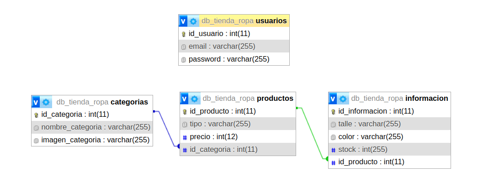

# 🛍️ **Trabajo Práctico: Tienda de Ropa**

## **👥 Participantes**:

- **Alumno 1:** Ariadna Avila
- **Alumno 2:** Juan Marcos Lorenzo

---

> ⚠️ **Descripción del Trabajo**  
> Este trabajo práctico consiste en el diseño y desarrollo de una web para una tienda de ropa. Los usuarios podrán interactuar con las distintas prendas disponibles, gestionando el stock, seleccionando talles y añadiendo productos al carrito.  
> La base de datos está diseñada para gestionar productos y su información asociada, permitiendo a la tienda administrar eficientemente su catálogo.

---

## 📊 **Estructura de la Base de Datos**

La base de datos está compuesta por dos tablas principales:

### **1. productos**:

> ℹ️ **Descripción**:  
> Esta tabla almacena la información principal de cada producto disponible en la tienda, como su nombre, código, precio y cantidad en stock.

> **Campos principales**:
>
> - `id_producto` (clave primaria)
> - `tipo`
> - `precio`
> - `id_categoria` (clave foránea)

### **2. categorias**:

> ℹ️ **Descripción**:  
> Contiene información sobre las categorías, como el nombre de la categoría, el id de cada categoría, y una columna para imágenes.

> **Campos principales**:
>
> - `id_categoria` (clave primaria)
> - `nombre_categoria`
> - `imagen_categoria`

---

## 🔗 **Relación entre las Tablas**

> 🔄 **Uno a Muchos**:  
> La relación entre la tabla `productos` y `categorias` es de uno a N (_uno a muchos_), donde cada producto en la tabla `productos` tiene una entrada correspondiente en `categorias` que contiene información más detallada.

---

## 🎯 **Objetivo**

> 💡 **Descripción**:  
> El objetivo de este trabajo es demostrar el uso de bases de datos relacionales para gestionar información de productos en el contexto de una tienda de ropa, asegurando que la estructura esté normalizada y facilite consultas eficientes.

---

## 🚀 **Despliegue del Sitio en un Servidor con Apache y MySQL**

### **Requisitos previos**

- Servidor con Apache instalado (como XAMPP o LAMP).
- MySQL instalado y corriendo.
- PHP configurado correctamente en el servidor.

### **Pasos para el despliegue:**

1. **Clonar o descargar el proyecto en el servidor:**

   - Copia todos los archivos del proyecto en el directorio `htdocs` de Apache, normalmente en `/opt/lampp/htdocs` en Linux (o el directorio equivalente en otras plataformas).

2. **Configurar la base de datos:**

   - Crea una base de datos MySQL para la tienda. Puedes usar phpMyAdmin o ejecutar el siguiente comando en la consola MySQL:
     ```sql
     CREATE DATABASE tienda_ropa;
     ```
   - Importa el archivo SQL incluido en el proyecto para generar las tablas `productos` y `categorias`:

3. **Configurar el archivo `config.php`:**

   - Asegúrate de configurar las credenciales correctas en el archivo `config.php` para que el sitio se conecte a la base de datos. A continuación, un ejemplo de configuración:
     ```php
     <?php
     define('DB_SERVER', 'localhost');
     define('DB_USERNAME', 'root');
     define('DB_PASSWORD', '');
     define('DB_NAME', 'db_tienda_ropa');
     ?>
     ```

4. **Configurar Apache para el despliegue del sitio:**

   - Si usas XAMPP, asegúrate de iniciar Apache y MySQL desde el panel de control.
   - Si estás en un servidor Linux, asegúrate de que Apache esté corriendo:
     ```bash
     sudo systemctl start apache2
     sudo systemctl start mysql
     ```

5. **Acceder al sitio:**
   - Abre tu navegador y accede a `http://localhost/TPE-WEB2-PrimeraEntrega/home`.

---

## 🔑 **Usuarios y Contraseñas de Administrador**

### Usuario Administrador:

- **Usuario**: `webadmin`
- **Contraseña**: `admin`


